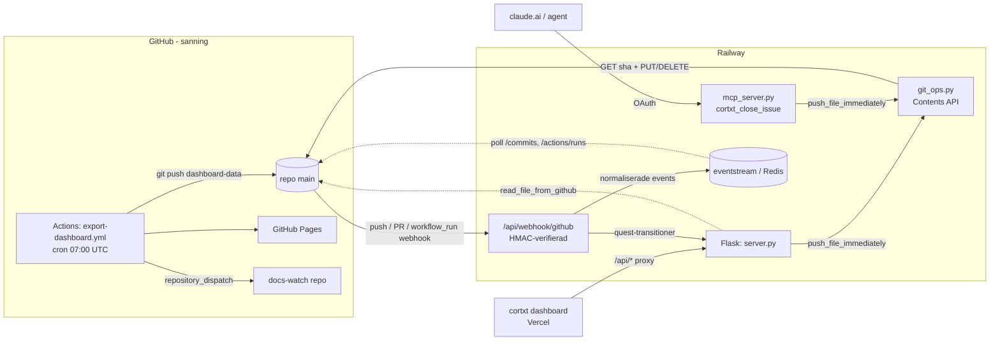

# CLAUDE.md — Project-CNS

CNS-kärnan och backenden. Läs detta först varje session. Arbetsspråk: **svenska**.

## Vad det är
CNS (Central Node Store): ett lokalt-först, Markdown-baserat system för att modellera och driva ett produktsystem från idé till drift. Varje nod = `nodes/<slug>/node.md` (YAML-frontmatter + sektioner). **GitHub är källan till sanning.**

## Nodmodellen (viktigast)
Två ortogonala dimensioner per nod:
- `kind`: component | system | framework. **Emergerar ur struktur, deklareras inte:** en nod är ett *system* om andra noder pekar på den via `part_of`, en *component* om inga gör det, ett *framework* om den är toppnivå. Modellen är fraktal.
- `stage`: idea | building | working | maturing. **"idea" är en stage, inte en kind** — det finns inga fristående produktidéer; allt är en komponent i något utvecklingsskede.

Tre relationer driver grafen: `part_of` (tillhörighet/nesting), `feeds` (dataflöde), `depends_on` (beroende).

Filnamnet är **alltid `node.md`** oavsett kind — all kod globar `*/node.md` (katalogen är `nodes/`, via `NODES_DIR` i `md_parser.py`). Kind kan ändras utan att byta filnamn. (Historik: hette tidigare `project.md` i `projects/` — bytt i branchen `rename-project-to-node`.)

## Repo-layout
- `cns.py` — CLI-entrypoint
- `scripts/md_parser.py` — läser/skriver node.md; kind-medvetna sektionsmallar (COMPONENT/SYSTEM/FRAMEWORK_SECTIONS)
- `scripts/validator.py` — schemavalidering (`cns validate <slug>`)
- `scripts/json_exporter.py` — exporterar alla noder till nodes.json
- `scripts/analyst.py` — AI-analys (anropar Claude via ANTHROPIC_API_KEY)
- `scripts/portfolio_brief.py` — daglig portföljbrief
- `scripts/quest_manager.py` — **legacy** quest-livscykel (JSON). Ersatt av `issues_client` (quest=milestone); kvar tills rivningssteget landar — bygg inget nytt mot den.
- `scripts/issues_client.py` — **arbetsuppgiftslagret** (GitHub REST, ingen `git`-subprocess). Tre nivåer: nod (label `node:<slug>`) ← **quest = GitHub Milestone** (grupperar issues, progress beräknas av GitHub) ← **issue = uppgift** (open/closed). Under issue: **todos = task-list-checkboxar** i issue-body (`- [ ]`/`- [x]`, `parse_todos`/`add_todo`/`set_todo`) — delstegsnivån, sanningen lever på GitHub. Verktygen i `app/tools/{issues,quests}.py`.
- `scripts/idea_inbox.py` — idé-inkorg (lättviktig fångst; `exports/ideas/<id>.json`, glob `idea-*.json`; valfritt `session_id`). Promote → `issues_client.create_issue` (`cortxt_promote_idea_to_issue`, ev. under en quest/milestone).
- `scripts/btw_log.py` — btw-sessionslogg. **Personlig logg, ej produktdata:** `/btw`-asides (Claude Code-forkkommandot) grupperade per session i `exports/btw/<session-id>.json`, mjukt länkbara till quest/idé via `link_session`. Rent datalager — pushar inte själv. **Isolerat:** rör inte nodmodellen eller `cns.py`. Fångas av `scripts/btw_capture.py` (hook-entry: läser ett transkripts `/btw`-kommandon idempotent på `src_uuid`, äger pushen). Körs av en **Stop-hook** i arbetsytans `.claude/settings.json` (inte i något repo). Inkoppling som `cns`-subkommando + MCP-verktyg väntar.
- `scripts/session_store.py` — sessioner (AI-arbetspass) som förstklassiga objekt; en post per fil i `exports/sessions/session-<id>.json` (glob `session-*.json`). Länkbar till quest/issue/idea/node via `(link_kind, link_ref)`; `transcript_id` pekar på Claude Code-`.jsonl`. `running → done` är en **pollbar signal** (en parallell session kan `/loop`:a tills en annan flippar `done` innan den mergar). **Rent datalager — pushar inte själv;** pushen ligger i MCP-wrappern (`app/tools/sessions.py`: `cortxt_start_session`/`cortxt_mark_session_done`/`cortxt_save_session`/`cortxt_list_sessions`/`cortxt_fork_session`/`cortxt_get_session_tree`), samma split som idéer/btw. `list_sessions(link_ref=<nod>)` = **överlappsfrågan** (flera sessioner på samma nod ⇒ arbete att förena). **Sessionsträd:** valfritt `parent_id` (None = rot/"main") gör forks-under-forks möjliga, ortogonalt mot `link`; `fork_session` skriver `parent_id` explicit (till skillnad från `/btw`), `children`/`ancestry`/`tree` traverserar. `cns`-subkommando väntar (samma isolation som btw/tui). **Sessionstyp:** valfritt `type`-fält (brainstorm | bygg | triage | review, `VALID_SESSION_TYPES`; None på gamla poster) + lokal aktiv-typ-markör `exports/active_session.json` (`set_active`/`get_active`/`clear_active`, mini-CLI `python scripts/session_store.py set-active <typ>`). Markören läses av `router.py`-hooken som injicerar `[SESSION: <typ> — <direktiv>]` per prompt och flaggar `[SESSION-SKIFTE?]` när prompten signalerar annan typ (regelbaserat, ingen LLM) — bekräftat byte = markera done + forka barn-pass, aldrig tyst mutation. Markören är en sidofil (inte en session-post) eftersom hooken behöver omedelbar lokal synlighet medan kanonisk bokföring går via GitHub.
- `scripts/recommend.py` — **sessionsrekommendationer**: regelbaserat lager ovanpå datalagret (idéer lokalt, quests via `issues_client` med TTL-cache i `exports/recommend_cache.json`, sessioner). Ger `--json` (för `/sessions`-skillen i arbetsytan) och `--statusline` (Claude Codes statusrad, konfigurerad i arbetsytans `.claude/settings.json`). Rekommenderar en av de **standardiserade sessionstyperna** i `sessions/profiles/<typ>.md` (brainstorm | bygg | triage | review — YAML-frontmatter + agentbeteende per typ; `/session <typ>`-skillen läser profilen och ställer om beteendet, bokför via `cortxt_start_session`). Rent datalager-konsument, pushar inget.
- `scripts/git_ops.py` — direkt GitHub API-push
- `app/server.py` — Flask-backend (Railway)
- `app/mcp_server.py` — MCP-server (FastMCP, GitHub OAuth, Redis token-store). Äger auth + allowlist + `mcp`-instansen; verktygen själva bor i `app/tools/` (`issues`/`quests`/`ideas`/`projects`/`sessions`, var sin `register(mcp)`).
- `app/asgi.py` — ASGI-entrypoint. **FastMCP är yttersta appen** och äger `/mcp` + OAuth-routes (`/.well-known/...`, `/authorize`, `/token`); Flask monteras *inuti* via `a2wsgi` som fallthrough (WSGI kan inte hålla ASGI, därför denna riktning). Kör med uvicorn-worker, inte sync-gunicorn. `/mcp` exponeras bara när OAuth är konfigurerat (annars 503) — annars vore en data-muterande endpoint öppen.
- `schemas/node_schema.json` — JSON-schema
- `skills/` — portabla konventioner: `cortxt-quests` (quest/issue-arbetsflöde), `cns-flush` (spola ner en sessions slutsats i CNS via `cortxt_save_session`), `cns-sync` (read-only överlappsdetektering av parallella sessioner via `cortxt_list_sessions(link_ref=…)`, körs före flush), `cns-fork` (bokför en fork i sessionsträdet via `cortxt_fork_session`).
- `scripts/tui/` — interaktiv terminal-överblick (textual). **Isolerad:** konsumerar bara datalagret (`read_all_nodes`), rör inte `cns.py`. Körs via `python -m scripts.tui`. Inkoppling som `cns tui`-subkommando väntar tills CLI-flytten landat (lazy import). Beroende: `textual>=0.79,<1.0`.
  - `scripts/tui/agent_host.py` — **agent-host** (tangent `c` i TUI:t): driver Claude lokalt via **Claude Agent SDK** (`claude-agent-sdk`, valfritt extra i `requirements-agent.txt`), exponerar datalagret som in-process MCP-verktyg (`create_sdk_mcp_server` + `@tool`), read-first (`can_use_tool` nekar Write/Edit/Bash). Auth: env `ANTHROPIC_API_KEY` → otrackad `.cns-agent-key` → annars Claude Code-login. Rör inte `app/mcp_server.py`.
- `.mcp.json` — MCP-router (config), se "Agenter, verktygslåda & minne" nedan.
- `.claude/` — verktygslådan (Plan A), versionerad. Egen `README.md`.
- `agents/` — produktens agenter (Plan B), tom tills en verklig agent kräver det.

## Agenter, verktygslåda & minne (två plan)
Två skilda plan med **hård vägg emellan** — produktkod importerar aldrig från `.claude/`, och `.claude/` är aldrig ett produktberoende.
- **Plan A — verktygslådan (`.claude/`, versionerad här):** subagenter (`.claude/agents/`), egna skills (`.claude/skills/`), slash-kommandon (`.claude/commands/`), delade permissions (`.claude/settings.json`). Detta är hur *vi* driver portföljen, inte produkten. Arbetsytans `.claude/` är maskinlokal och oversionerad — lägg inget varaktigt där utom btw-Stop-hooken som redan bor i arbetsytans `settings.json`.
- **Plan B — produktens agenter (`agents/`):** om Cortxt själv ska köra agenter åt slutanvändare bor de här som produktkod, bredvid `app/` och `scripts/`. Tom tills en verklig agent kräver det.
- **MCP-router:** `.mcp.json` (versionerad) listar MCP-servrarna agenterna når — i dag bara `project-cns`. Detta *är* routern nu (config-router). En separat gateway-process är inritad som idé-noden `mcp-gateway` (`depends_on: cns-mcp`) och byggs först när Plan B-agenter når många servrar.
- **MCP-verktyg bor i `app/tools/`:** en domänmodul per område, var och en med `register(mcp)`. `app/mcp_server.py` äger bara auth, allowlist-middleware och `mcp`-instansen och anropar varje moduls `register`. Nya verktyg läggs som en `@mcp.tool` i rätt modul (eller en ny modul), mot `scripts/`-datalagret — **inte** som fler dekoratörer i `mcp_server.py`. Verktygsnamnen är connector-kontrakt mot claude.ai och måste vara stabila vid flytt mellan moduler.
  - CNS-data: `issues` / `quests` / `ideas` / `projects` (noder) / `sessions`
  - GitHub-ytor: `prs` (Pull Requests) / `gh_projects` (Projects v2 GraphQL) / `actions` (workflow_dispatch + run-status) / `wiki` (Contents API mot `{repo}.wiki`)
  - Extern integration: `linear` (Linear REST+GraphQL, kräver `LINEAR_API_KEY`)

### Fyra minneslager (förväxla inte)
- **Claude-minne** (`~/.claude/projects/.../memory/`) — hur Claude ska jobba med dig. Personligt, Plan A.
- **Sessionsminne** — `exports/btw/` (btw-asides per session) **och** `exports/sessions/` (`session_store.py`, AI-arbetspass som förstklassiga objekt). Arbetstillstånd, ej kunskap.
- **Kunskap/wiki** (`nodes/*/node.md`) — varaktig portföljkunskap, produktens sanning. `.qoder/repowiki/` är verktygsgenererat och räknas inte.
En agent som lär sig något *bestående om portföljen* skriver en nod; något *om sessionen/arbetspasset* → btw/sessions; något *om hur Claude ska bete sig* → Claude-minnet.

## Deploy & dataflöde
- GitHub = sanning. AI-genererat innehåll pushas via **direkt GitHub API** (`git_ops.py`), inte till Railways efemära disk.
- Backend på Railway: `https://project-cns-production.up.railway.app`. `/api/nodes` kör `git_pull()` + `export_json()` live.
- Dashboarden (separat `cortxt`-repo på Vercel) proxar `/api/*` hit via sin `vercel.json`.
- **En nod är inte "tillagd" förrän den är committad, pushad OCH exporterad.** Nya mappar måste `git add`:as explicit — `git commit -am` missar otrackade filer.

## GitHub-interaktion
Tre kanaler, lätta att förväxla:

**1. Inkommande webhooks (GitHub → Flask).** `app/server.py` → `/api/webhook/github`. HMAC-SHA256 mot `CNS_WEBHOOK_SECRET` (header `X-Hub-Signature-256`; fel → 401). Tre events (via `X-GitHub-Event`):
- `push` → slug ur ändrade filvägar → **auto-completar quests** (`_slugs_from_pushed_files`, `_complete_quests_for_slugs`).
- `pull_request` → slug ur titel/body/branch → `opened` **startar**, `merged` **completar** quest.
- `workflow_run` (completed) → sätter **CI-status** (`passing`/`failing`).
Efter quest-logiken loggas varje event till **eventstream (Redis)** via `scripts/eventstream.py` (`normalize_*` → `push_to_redis`).
> Noden `github-webhook` *är* denna mottagare. `webhook-router` är ett fristående devtool — **inte** detta (namnkrock).

**2. Utgående skrivningar (Flask/MCP → GitHub Contents API).** `app/git_ops.py` — använder REST `https://api.github.com`, **inte** `git`-subprocess (Railway saknar `.git/`). Env: `CNS_GITHUB_TOKEN` + `GITHUB_REPO`, branch `main`.
- `push_file_immediately()` — huvudvägen: GET sha → PUT en fil. Anropas av muterande endpoints i `server.py` (projekt-edit, `export nodes.json`) och av MCP-verktygen i `app/tools/` (idé-capture/promote, session start/save/fork). Arbetsuppgifter (issues/milestones/todos) muteras däremot via `issues_client` direkt mot GitHub Issues-API:t, inte via Contents-API:t.
- `git_commit_and_push()` — scannar `nodes/`+`exports/` efter filer ändrade senaste 60 s.
- `delete_file_on_github()` — DELETE. `read_file_from_github()` — GET (läsning, se nedan).

**3. Pollande läsning (CNS → GitHub API).** `scripts/eventstream.py` pollar `GET /repos/{repo}/commits` och `/actions/runs`. `read_file_from_github()` läser tillbaka genererad JSON (devwatch/devlog/eventstream) i `server.py` och `scripts/portfolio_brief.py`.

**4. GitHub Actions (körs *på* GitHub).** `.github/workflows/export-dashboard.yml` — cron 07:00 UTC + manuell. Genererar export → committar som `github-actions[bot]` med riktig `git push` (checkout-miljö, inte Contents API) → deployar GitHub Pages → triggar `docs-watch`-repot via `repository_dispatch` (PAT_TOKEN).

## Enums
**Enkälla: `schemas/enums.json`** — läses av `scripts/validator.py` (Python, som `set`; därifrån importerar analyst.py/server.py) och av `cortxt/packages/cns-schema` (JS, genererad via dess `generate.mjs`). Ändra värden där, inte handkodat. Lägg INTE in layer/pipeline/family (legacy, ovaliderade — kvar som referens i validator.py).
- status: idea | early_mvp | mvp | live | shelved
- stage: idea | building | working | maturing
- kind: component | system | framework
- mvp_stage, risk_category: se `enums.json`

## Automatisk agent-routing
Hooken `scripts/router.py` (UserPromptSubmit) injicerar `[ROUTING] @agent → reason` per prompt baserat på nyckelord i meddelandet. **Regel: när [ROUTING] syns i kontexten, delegera direkt till angiven agent utan att fråga Rikard.** Använd Agent-verktyget med `subagent_type="<agent-slug>"` och skicka med hela originaluppgiften. **När [MODEL: X] också injiceras — sätt `model="X"` på Agent-anropet så uppgiften körs på rätt modellnivå istället för Sonnet-huvudloopen.** Konversationella frågor (< 25 tecken) och prompts utan träff hanteras direkt.

Routing-tabell (snabbref):

| Agent | Triggas av |
|---|---|
| `ekonomen` | kostnader, token-budget, uppskattning |
| `ide-agent` | idéer, brainstorm, roadmap |
| `wiki-skribent` | wiki, dokumentera, memory-card |
| `research-agent` | research, utreda, jämför |
| `github-agent` | PR, issue, CI/CD, deploy, railway/vercel |
| `stadaren` | städa, refaktorera, dead code |
| `hr-chefen` | ny agent, agentprofil, teamstruktur |
| `frontend-agent` | React, Vite, CSS, UI-komponent |
| `backend-agent` | Flask, MCP-server, API, webhook |
| `scripts-agent` | script, hook, automation |
| `teamleader` | planera, sprint, orchestration, multi-agent |
| `dirigenten` | kedja sessioner, daemon, hängande session, nästa session |

## Arbetsregler
- **Spec först:** skriv/granska en implementationsspec innan kod. Vid osäkerhet — ställ frågan i specen så den måste besvaras.
- **Additiv migrering:** nya fält är valfria; migrera en nod i taget; behåll fallback på gamla fält så dashboarden inte bryts.
- **Övergeneralisera inte mallar:** inga mallvarianter förrän en verklig nod kräver det.
- Validera (`cns validate <slug>`) innan commit — särskilt handskrivna noder.
- AI-funktioner (analyze, suggest-quest, brief, devlog) kräver `ANTHROPIC_API_KEY` satt på Railway.
- **`cortxt_mark_session_done` kräver explicit done-checklista:** (1) ursprungsuppgiften är levererad, (2) kod är committad och pushad om kodändringar gjordes, (3) öppna delfrågor är fångade som idéer/todos. Anropa aldrig done om någon av dessa inte stämmer.

## Underhåll av denna fil
Denna fil läses in varje session och är din primära kontext. **Uppdatera den i samma ändring som du ändrar något den beskriver** — arkitektur, dataflöde, repo-layout, konventioner, nya/omdöpta noder, eller en gotcha du snubblat på. Håll den koncis och högsignalerad: det här är inte fullständig dokumentation, utan det du behöver för att inte göra fel. Låter du den driva börjar varje framtida session från felaktiga antaganden.
