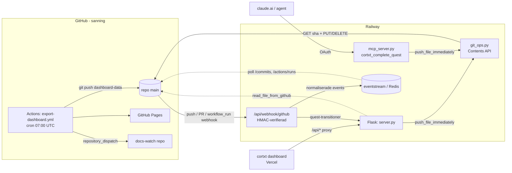

# CLAUDE.md — Project-CNS

CNS-kärnan och backenden. Läs detta först varje session. Arbetsspråk: **svenska**.

## Vad det är
CNS (Central Node Store): ett lokalt-först, Markdown-baserat system för att modellera och driva ett produktsystem från idé till drift. Varje nod = `nodes/<slug>/node.md` (YAML-frontmatter + sektioner). **GitHub är källan till sanning.**

## Nodmodellen (viktigast)
Två ortogonala dimensioner per nod:
- `kind`: component | system | framework. **Emergerar ur struktur, deklareras inte:** en nod är ett *system* om andra noder pekar på den via `part_of`, en *component* om inga gör det, ett *framework* om den är toppnivå. Modellen är fraktal.
- `stage`: idea | building | working | maturing. **"idea" är en stage, inte en kind** — det finns inga fristående produktidéer; allt är en komponent i något utvecklingsskede.

Tre relationer driver grafen: `part_of` (tillhörighet/nesting), `feeds` (dataflöde), `depends_on` (beroende).

Filnamnet är **alltid `node.md`** oavsett kind — all kod globar `*/node.md` (katalogen är `nodes/`, via `NODES_DIR` i `md_parser.py`). Kind kan ändras utan att byta filnamn. (Historik: hette tidigare `project.md` i `projects/` — bytt i branchen `rename-project-to-node`.)

## Repo-layout
- `cns.py` — CLI-entrypoint
- `scripts/md_parser.py` — läser/skriver node.md; kind-medvetna sektionsmallar (COMPONENT/SYSTEM/FRAMEWORK_SECTIONS)
- `scripts/validator.py` — schemavalidering (`cns validate <slug>`)
- `scripts/json_exporter.py` — exporterar alla noder till nodes.json
- `scripts/analyst.py` — AI-analys (anropar Claude via ANTHROPIC_API_KEY)
- `scripts/portfolio_brief.py` — daglig portföljbrief
- `scripts/quest_manager.py` — quest-livscykel
- `scripts/idea_inbox.py` — idé-inkorg (lättviktig fångst under quests; `exports/ideas/<id>.json`, glob `idea-*.json`). Promote → `quest_manager.create_quest`.
- `scripts/git_ops.py` — direkt GitHub API-push
- `app/server.py` — Flask-backend (Railway)
- `app/mcp_server.py` — MCP-server (FastMCP, GitHub OAuth, Redis token-store)
- `app/asgi.py` — ASGI-entrypoint. **FastMCP är yttersta appen** och äger `/mcp` + OAuth-routes (`/.well-known/...`, `/authorize`, `/token`); Flask monteras *inuti* via `a2wsgi` som fallthrough (WSGI kan inte hålla ASGI, därför denna riktning). Kör med uvicorn-worker, inte sync-gunicorn. `/mcp` exponeras bara när OAuth är konfigurerat (annars 503) — annars vore en data-muterande endpoint öppen.
- `schemas/node_schema.json` — JSON-schema
- `skills/` — portabla konventioner (t.ex. cortxt-quests)
- `scripts/tui/` — interaktiv terminal-överblick (textual). **Isolerad:** konsumerar bara datalagret (`read_all_nodes`), rör inte `cns.py`. Körs via `python -m scripts.tui`. Inkoppling som `cns tui`-subkommando väntar tills CLI-flytten landat (lazy import). Beroende: `textual>=0.79,<1.0`.

## Deploy & dataflöde
- GitHub = sanning. AI-genererat innehåll pushas via **direkt GitHub API** (`git_ops.py`), inte till Railways efemära disk.
- Backend på Railway: `https://project-cns-production.up.railway.app`. `/api/nodes` kör `git_pull()` + `export_json()` live.
- Dashboarden (separat `cortxt`-repo på Vercel) proxar `/api/*` hit via sin `vercel.json`.
- **En nod är inte "tillagd" förrän den är committad, pushad OCH exporterad.** Nya mappar måste `git add`:as explicit — `git commit -am` missar otrackade filer.

## GitHub-interaktion
Tre kanaler, lätta att förväxla:

**1. Inkommande webhooks (GitHub → Flask).** `app/server.py` → `/api/webhook/github`. HMAC-SHA256 mot `CNS_WEBHOOK_SECRET` (header `X-Hub-Signature-256`; fel → 401). Tre events (via `X-GitHub-Event`):
- `push` → slug ur ändrade filvägar → **auto-completar quests** (`_slugs_from_pushed_files`, `_complete_quests_for_slugs`).
- `pull_request` → slug ur titel/body/branch → `opened` **startar**, `merged` **completar** quest.
- `workflow_run` (completed) → sätter **CI-status** (`passing`/`failing`).
Efter quest-logiken loggas varje event till **eventstream (Redis)** via `scripts/eventstream.py` (`normalize_*` → `push_to_redis`).
> Noden `github-webhook` *är* denna mottagare. `webhook-router` är ett fristående devtool — **inte** detta (namnkrock).

**2. Utgående skrivningar (Flask/MCP → GitHub Contents API).** `app/git_ops.py` — använder REST `https://api.github.com`, **inte** `git`-subprocess (Railway saknar `.git/`). Env: `CNS_GITHUB_TOKEN` + `GITHUB_REPO`, branch `main`.
- `push_file_immediately()` — huvudvägen: GET sha → PUT en fil. Anropas av nästan alla muterande endpoints i `server.py` (quest create/update/activate/complete/archive, projekt-edit, `export nodes.json`) och av `mcp_server.py` `cortxt_complete_quest` (agent-initierad commit).
- `git_commit_and_push()` — scannar `nodes/`+`exports/` efter filer ändrade senaste 60 s.
- `delete_file_on_github()` — DELETE. `read_file_from_github()` — GET (läsning, se nedan).

**3. Pollande läsning (CNS → GitHub API).** `scripts/eventstream.py` pollar `GET /repos/{repo}/commits` och `/actions/runs`. `read_file_from_github()` läser tillbaka genererad JSON (devwatch/devlog/eventstream) i `server.py` och `scripts/portfolio_brief.py`.

**4. GitHub Actions (körs *på* GitHub).** `.github/workflows/export-dashboard.yml` — cron 07:00 UTC + manuell. Genererar export → committar som `github-actions[bot]` med riktig `git push` (checkout-miljö, inte Contents API) → deployar GitHub Pages → triggar `docs-watch`-repot via `repository_dispatch` (PAT_TOKEN).

## Enums
**Enkälla: `schemas/enums.json`** — läses av `scripts/validator.py` (Python, som `set`; därifrån importerar analyst.py/server.py) och av `cortxt/packages/cns-schema` (JS, genererad via dess `generate.mjs`). Ändra värden där, inte handkodat. Lägg INTE in layer/pipeline/family (legacy, ovaliderade — kvar som referens i validator.py).
- status: idea | early_mvp | mvp | live | shelved
- stage: idea | building | working | maturing
- kind: component | system | framework
- mvp_stage, risk_category: se `enums.json`

## Arbetsregler
- **Spec först:** skriv/granska en implementationsspec innan kod. Vid osäkerhet — ställ frågan i specen så den måste besvaras.
- **Additiv migrering:** nya fält är valfria; migrera en nod i taget; behåll fallback på gamla fält så dashboarden inte bryts.
- **Övergeneralisera inte mallar:** inga mallvarianter förrän en verklig nod kräver det.
- Validera (`cns validate <slug>`) innan commit — särskilt handskrivna noder.
- AI-funktioner (analyze, suggest-quest, brief, devlog) kräver `ANTHROPIC_API_KEY` satt på Railway.

## Underhåll av denna fil
Denna fil läses in varje session och är din primära kontext. **Uppdatera den i samma ändring som du ändrar något den beskriver** — arkitektur, dataflöde, repo-layout, konventioner, nya/omdöpta noder, eller en gotcha du snubblat på. Håll den koncis och högsignalerad: det här är inte fullständig dokumentation, utan det du behöver för att inte göra fel. Låter du den driva börjar varje framtida session från felaktiga antaganden.
