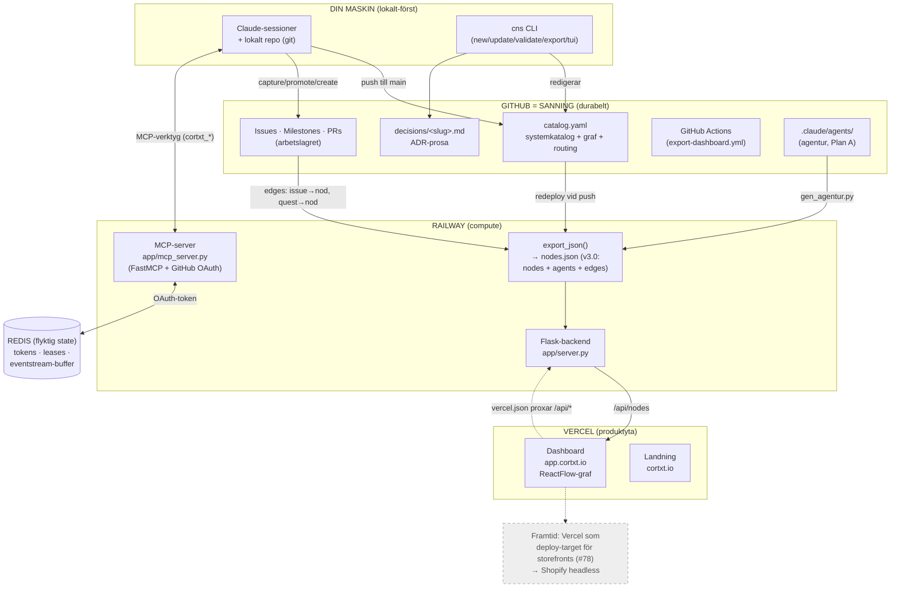
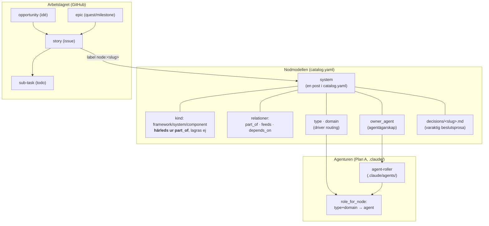

# Cortxt — orienteringsvy

> En aktuell karta över hela systemet: **var saker bor**, **hur arbete flyttas uppåt mot main**, och
> **de begrepp** modellen bygger på. Uppdaterad efter nodmodell-teardownen (epic #11, 2026-06-12).
> Diagrammen är Mermaid (renderas i GitHub och dashboarden). Håll den aktuell när arkitektur ändras.

**Tre distinkta namn, lätt att förväxla:**
- **CNS** = hjärnan/datalagret — repo `Project-CNS` (Python-backend, nodmodellen).
- **cortxt** = ansiktet/dashboarden — repo `cortxt` (React, Vercel).
- **Cortxt** = produkten som helhet (båda repona).

---

## 1. Infra-topologi — hur det hänger ihop idag

**Nyckelfakta (lätta att snubbla på):**
- **GitHub är sanning, inte en eker.** `catalog.yaml` + `decisions/` + issues/milestones/PRs lever här.
- **Railway pullar INTE vid runtime.** `git_pull()` är en no-op; `/api/nodes` kör `export_json()` mot
  den utcheckning som gjordes **vid deploy**. Färskhet i dashboarden = Railway **auto-redeployar vid
  push till main**. Syns inte en ändring trots att den ligger på main ⇒ Railway har inte redeployat.
- **Deployen byggs från repo-roten och bär BÅDE Core och Lab.** Root-`railway.json` (NIXPACKS) kör
  `app.asgi` från `lab/` med `PYTHONPATH=/app:/app/lab`. Skälet: `scripts/` är ett namespace-paket
  som spänner root (Core) + `lab/` (Lab), och backenden importerar Core (`cns-mcp depends_on cns-core`).
  Root Directory = `lab/` skulle bryta det. (Core/Lab-splitten flyttade av misstag bort root-config →
  5 dagars frusna deploys; root-`railway.json` är enkällan nu.)
- **Redis = flyktig state** (MCP-tokens, dispatch-leases, eventstream-live-buffer); **GitHub = durabel
  state**. Samma sorts sak (state) på en durabilitetsskala — inte två olika lager. **Sessioner ligger
  INTE i Redis** — de är filbaserade (`exports/sessions/`, pushas via MCP-wrappern). Leasen är
  **fail-open**: är Redis nere degraderas koordineringen, arbetet blockeras inte.
- **Vercel underligger Shopify** (kommande): CNS bygger en *Vercel-driftsadapter*, inte ett
  Shopify-integrationslager. Storefronts kör på Vercel, konsumerar Shopify headless.

---

## 2. Arbetsflöde — hur arbete fördelas och flyttas uppåt mot main

```mermaid
flowchart LR
    IDEA["💡 Idé<br/>idea_inbox<br/>(opportunity)"]
    ISSUE["📋 Issue<br/>= story<br/>label node:&lt;slug&gt;"]
    QUEST["🎯 Quest<br/>= epic<br/>(GitHub Milestone)"]
    INIT["Initiative<br/>(valfri toppnivå)"]

    subgraph DISPATCH["dispatch-loop (agenturens puls, övervakad crawl)"]
        PICK["assess_suitability<br/>(hoppar diffusa/<br/>feature-tunga/oklara-dep)"]
        LEASE["lease_store.claim<br/>(Redis, fail-open)"]
        SYNC["cns-sync / overlap<br/>(check_session_overlap)"]
        ROLE["role_for_node<br/>(catalog type/domain<br/>→ agentur_routing<br/>→ rätt agent + modell)"]
        RUN["agent_host.run_turn<br/>(read-first ELLER<br/>skriv-läge i worktree)"]
        EVAL["eval-grind (#57)<br/>+ bokför session"]
    end

    PR["📝 Draft-PR<br/>+ required reviewer"]
    HUMAN{"människa-grind<br/>(default: autonomy=False)"}
    MAIN["✅ main"]
    REDEPLOY["Railway redeploy<br/>→ ny nodes.json<br/>→ dashboard uppdateras"]

    IDEA -->|"promote"| ISSUE
    ISSUE -->|"under"| QUEST
    QUEST -.->|"under"| INIT
    ISSUE --> PICK
    PICK --> LEASE --> SYNC --> ROLE --> RUN --> EVAL
    EVAL -->|"skriv-läge"| PR
    PR --> HUMAN
    HUMAN -->|"merge"| MAIN
    MAIN --> REDEPLOY

    style HUMAN fill:#fff3cd,stroke:#e0a800
    style MAIN fill:#d4edda,stroke:#28a745
```

**Hur arbete dekomponeras (inuti ett issue):**
- **todos** = task-list-checkboxar i issue-body (sub-tasks).
- **acceptanskriterier** = Given/When/Then under `## Acceptanskriterier` (agentens DoD, skild från todos).
- **depends_on** = `Depends-on: #12, #34`-rad → en DAG så oberoende delar kan delas ut utan krockar.

**Grindarna uppåt (vad som krävs för att flytta arbete mot main):**
- Dispatch kör **ETT pass** per varv; varje muterande steg passerar en `approve`-callback (default nekar).
- Skriv-läge kör i en **isolerad git-worktree** → committar → öppnar **draft-PR** + required reviewer.
- **Default = människa-grind** (`autonomy=False`): draft-PR + required reviewer, ingen auto-merge. En
  **lågrisk-self-merge-väg** finns som inaktiv Fas 5-kapacitet (`--autonomy` + `classify_risk`: bara
  docs/deps/tooling/tester self-mergas; feature-kod/schema/produktion/eval-fall eskaleras alltid).
- Merge till main → Railway redeployar → `nodes.json` regenereras → dashboarden speglar nya läget.

> Dispatch känner **medvetet inte** nodmodellens filform — den litar på `role_for_node`-seamet. Därför
> kunde hela node.md→catalog.yaml-teardownen göras utan att röra loopen.

---

## 3. Begreppskarta — de nya begreppen och hur de relaterar

### Ordlista — en kanonisk term per koncept

| CNS-term | Kanonisk term | Vad det är |
|----------|---------------|------------|
| system (`catalog.yaml`-post) | **component** | En nod i systemkatalogen (förr node.md, rivet 2026-06-12) |
| idé | **opportunity** | Lättviktig fångst i idé-inkorgen |
| quest | **epic** | GitHub Milestone — grupperar issues |
| issue | **story** | Arbetsuppgift (bug/spike/chore via `type`-fält) |
| todo | **sub-task** | Task-list-checkbox i issue-body |
| session | **run** | Ett AI-arbetspass (förstklassigt objekt) |
| — | **initiative** | Valfri toppnivå över epic |

### Centrala begrepp

- **catalog.yaml** — enda strukturerade källan för nodmodellen. Ett system per post:
  `title/summary/part_of/feeds/depends_on/type/domain/owner_agent`.
- **decisions/&lt;slug&gt;.md** — glesa ADR-noter; bara där varaktig beslutskunskap finns.
- **kind härleds** ur `part_of`: *framework* (toppnivå) · *system* (har barn) · *component* (löv). Fraktal.
- **part_of / feeds / depends_on** — tillhörighet · dataflöde · beroende. Grafen mellan system.
- **type / domain** — klassificering som driver agent-routingen (`role_for_node`).
- **agentur** — roster av agent-roller (`.claude/agents/`). `owner_agent` knyter ett system till en ägare;
  `role_for_node` routar arbete till rätt agent ur systemets `type`/`domain`.
- **dispatch-loop** — agenturens puls: plockar ett lämpligt issue, routar till rätt agent, kör ett
  övervakat pass, öppnar gatead draft-PR.
- **sessions** — AI-arbetspass som förstklassiga objekt (`exports/sessions/`). `running → done` är en
  pollbar signal (parallella sessioner kan vänta in varandra före merge).

### Fyra minneslager (förväxla inte)

| Lager | Var | Vad |
|-------|-----|-----|
| Claude-minne | `~/.claude/.../memory/` | Hur Claude ska jobba med dig (personligt) |
| Sessionsminne | `exports/btw/` + `exports/sessions/` | Arbetstillstånd per pass, ej kunskap |
| Kunskap | `catalog.yaml` + `decisions/` | Varaktig portföljkunskap (produktens sanning) |

Regel: lär du dig något *bestående om strukturen* → `catalog.yaml`; en *varaktig beslutskunskap* →
`decisions/`; något *om passet* → btw/sessions; något *om hur Claude ska bete sig* → Claude-minnet.

### Två plan (hård vägg emellan)

- **Plan A — verktygslådan** (`.claude/`): hur *vi* driver portföljen (agenter, skills, kommandon). Versionerad.
- **Plan B — produktens agenter** (`agents/`): om Cortxt själv kör agenter åt slutanvändare. Tom tills behov.
- Produktkod importerar aldrig från `.claude/`; `.claude/` är aldrig ett produktberoende.

---

## Var saker faktiskt bor (snabbreferens)

| Vad | Var |
|-----|-----|
| Systemkatalogen | `catalog.yaml` (repo-rot) |
| Nod-prosa | `decisions/<slug>.md` — varför ett system ser ut som det gör (maskinläst) |
| Reglerna | Obsidian-vaulten, `Playbook/Rules/` — kanoniskt. Inte i detta repo. |
| Katalog-läsaren | `scripts/catalog.py` (`load_catalog`, `derive_kind`) |
| Export till dashboard | `lab/scripts/json_exporter.py` |
| Arbetslagret | GitHub Issues/Milestones/PRs via `lab/scripts/issues_client.py` |
| Agenturen (dispatch, routing, agenter, TUI) | **Riven 2026-07-13.** Frystes 2026-07-12, revs sedan helt — git är minnet |
| MCP-verktyg | **Rivna 2026-07-13** — 53 exponerade, noll anrop |
| Backend | `lab/app/server.py` (Flask) på Railway — fyra läs-endpoints |
| Dashboard | repo `cortxt`, Vercel, `app.cortxt.io` |
| Färskhetscheck | `scripts/prose_check.py` — håller beskrivande prosa mot källan |

> Sökvägarna ovan bär `lab/`-prefix sedan Core/Lab-splitten: repo-roten är Core (katalog, CLI,
> validering), allt övrigt bor i `lab/`.
>
> **Två lager sedan rivningen 2026-07-13:** Core (repo-roten — katalog, CLI, validering) · Lab
> (`lab/scripts`, `lab/app` — pipelinen, cockpiten, GitHub-ryggraden). Frozen-lagret revs; det som
> frystes 2026-07-12 väcktes aldrig, och ett lik i en garderob är fortfarande ett lik. Historiken
> ligger i git.

> Detaljerad arkitektur per modul: `lab/CLAUDE.md`.
