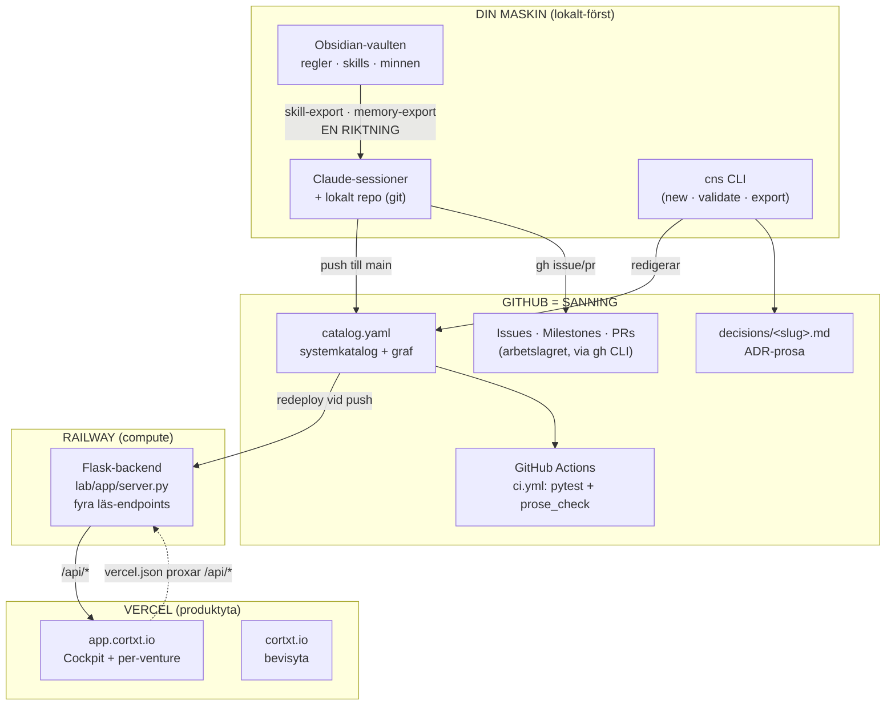
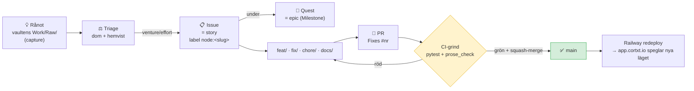
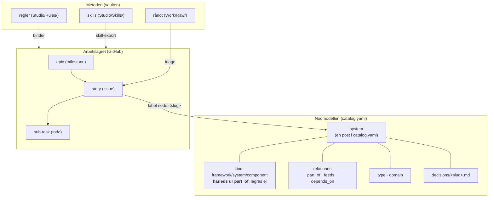

# Cortxt — orienteringsvy

> En karta över systemet: **var saker bor**, **hur arbete flyttas mot main**, och **begreppen**
> modellen bygger på. Uppdaterad efter rivningen 2026-07-13, då allt utan konsument togs bort.
> Diagrammen är Mermaid. **Håll den aktuell när arkitekturen ändras** — annars ritar den ett system
> som inte finns, vilket är precis vad den gjorde fram till idag.

**Tre distinkta namn, lätta att förväxla:**
- **CNS** = katalogen och backenden — repo `Project-CNS` (Python).
- **cortxt** = ytorna — repo `cortxt` (React, Vercel): cortxt.io + app.cortxt.io.
- **Cortxt** = helheten.

---

## 1. Infra-topologi — hur det hänger ihop idag

**Nyckelfakta (lätta att snubbla på):**
- **Railway pullar INTE vid runtime.** Backenden kör mot den utcheckning som gjordes **vid deploy**.
  Färskhet = Railway **auto-redeployar vid push till main**. Syns inte en ändring trots att den ligger
  på main ⇒ Railway har inte redeployat. Kolla Deployments-loggen, inte koden.
- **Deployen byggs från repo-roten och bär BÅDE Core och Lab.** Root-`railway.json` (NIXPACKS) kör
  `app.asgi` från `lab/` med `PYTHONPATH=/app:/app/lab`. Skälet: `scripts/` är ett namespace-paket som
  spänner root (Core) + `lab/` (Lab), och backenden importerar Core. Root Directory = `lab/` bryter det.
- **Vaulten äger skills och minnen.** Exporten går åt ett håll. Redigerar du exporten driver den från
  källan, och då finns två sanningar som tyst säger olika saker.
- **Arbete går genom `gh` CLI.** MCP-verktygen revs 2026-07-13 (53 exponerade, noll anrop).

---

## 2. Arbetsflöde — hur arbete flyttas mot main

**Hur ett issue dekomponeras:** todos = checkboxar i bodyn · acceptanskriterier = Given/When/Then
under `## Acceptanskriterier` (definition of done, skild från todos).

**Grindarna uppåt:** trunk-based, aldrig push till main, squash-merge, branchen raderas.
CI måste vara grön — och `prose_check` är en del av den, så **prosa som ljuger fäller bygget**.

---

## 3. Begreppskarta

### Ordlista — en kanonisk term per koncept

| CNS-term | Kanonisk term | Vad det är |
|----------|---------------|------------|
| system (`catalog.yaml`-post) | **component** | En nod i systemkatalogen |
| quest | **epic** | GitHub Milestone — grupperar issues |
| issue | **story** | Arbetsuppgift (bug/spike/chore via `type`-label) |
| todo | **sub-task** | Task-list-checkbox i issue-body |
| — | **initiative** | Valfri toppnivå över epic |

### Centrala begrepp

- **catalog.yaml** — enda strukturerade källan. Ett system per post.
- **decisions/&lt;slug&gt;.md** — glesa ADR-noter; bara där varaktig beslutskunskap finns.
- **kind härleds** ur `part_of`: *framework* (toppnivå) · *system* (har barn) · *component* (löv).
- **Hälsa härleds** vid läsning (`lab/scripts/health.py`), deklareras aldrig. En handsatt status blir
  själv inaktuell.
- **Prosa-arten** — `record` (registrerar ett vägval, redigeras aldrig) eller `description` (påstår
  något om nuet, måste ändras i samma PR som det den beskriver). Regeln bor i vaulten;
  `scripts/prose_check.py` verkställer den i CI.

### Två minneslager

| Lager | Var | Vad |
|-------|-----|-----|
| Claude-minne | vaultens `Studio/Memory/` → exporteras till `~/.claude/` | Hur Claude ska jobba med dig |
| Kunskap | `catalog.yaml` + `decisions/` | Varaktig portföljkunskap |

Sessionslagret (`exports/sessions/`) och btw-loggen revs 2026-07-13 — de skrev noll respektive tre
filer på en månad.

---

## Var saker faktiskt bor (snabbreferens)

| Vad | Var |
|-----|-----|
| Systemkatalogen | `catalog.yaml` (repo-rot) |
| Nod-prosa | `decisions/<slug>.md` |
| Reglerna | Obsidian-vaulten, `Studio/Rules/` — **kanoniskt**, inte i detta repo |
| Skills · minnen | vaultens `Studio/Skills/` · `Studio/Memory/` → exporteras härifrån |
| Katalog-läsaren | `scripts/catalog.py` (`load_catalog`, `derive_kind`) |
| Arbetslagret | GitHub, via `gh` CLI och `lab/scripts/issues_client.py` |
| Backend | `lab/app/server.py` (Flask) på Railway — fyra läs-endpoints |
| API-kontraktet | `tests/test_api_contract.py` + `tests/golden/` |
| Ytorna | repo `cortxt`, Vercel — cortxt.io + app.cortxt.io |
| Ärlighetsgrinden | `scripts/prose_check.py` — fäller bygget när prosan ljuger |

> **Två lager:** Core (repo-roten — katalog, CLI, validering) · Lab (`lab/scripts`, `lab/app` —
> backenden, pipelinen, GitHub-ryggraden). Core importerar aldrig Lab.

> Detaljerad arkitektur per modul: `lab/CLAUDE.md`.
