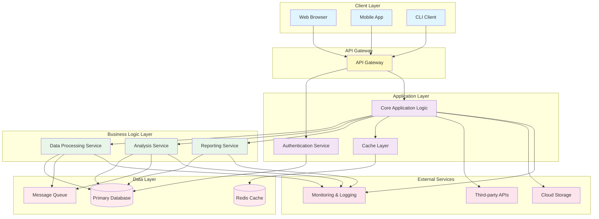

# Project CNS - Architecture Overview

## System Architecture

## Architecture Layers

### 1. **Client Layer**
- **Web Browser**: HTML5/JavaScript frontend application
- **Mobile App**: Native or cross-platform mobile clients
- **CLI Client**: Command-line interface for automation

### 2. **API Gateway**
- Centralized entry point for all client requests
- Request routing and load balancing
- Rate limiting and throttling
- Request/response transformation

### 3. **Application Layer**
- **Authentication Service**: User identity management and authorization
- **Core Application Logic**: Business logic orchestration
- **Cache Layer**: In-memory caching for performance optimization

### 4. **Business Logic Layer**
- **Data Processing Service**: ETL and data transformation
- **Analysis Service**: Data analysis and insights generation
- **Reporting Service**: Report generation and export

### 5. **Data Layer**
- **Primary Database**: Persistent data storage (SQL/NoSQL)
- **Redis Cache**: High-speed caching layer
- **Message Queue**: Asynchronous task processing

### 6. **External Services & Infrastructure**
- **Third-party APIs**: Integration with external services
- **Cloud Storage**: File and blob storage
- **Monitoring & Logging**: System observability and diagnostics

## Data Flow

1. **Client Request**: Initiated from any client (web, mobile, CLI)
2. **Gateway Processing**: Request validated and routed
3. **Authentication**: User credentials verified
4. **Business Logic**: Core services process the request
5. **Service Processing**: Specific service handles the operation
6. **Data Access**: Query/update database or cache
7. **Response**: Result sent back through the gateway to client

## Deployment Strategy

- **Containerization**: Docker containers for consistent deployment
- **Orchestration**: Kubernetes for container orchestration
- **CI/CD Pipeline**: Automated testing and deployment
- **Environment**: Development, Staging, Production environments

## Scalability Considerations

- Horizontal scaling of stateless services
- Database replication and sharding
- Caching strategy to reduce database load
- Message queue for asynchronous processing
- CDN for static asset delivery
